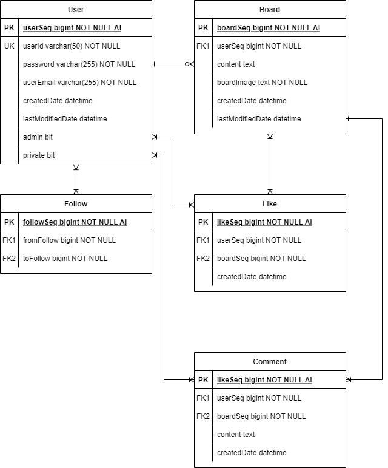
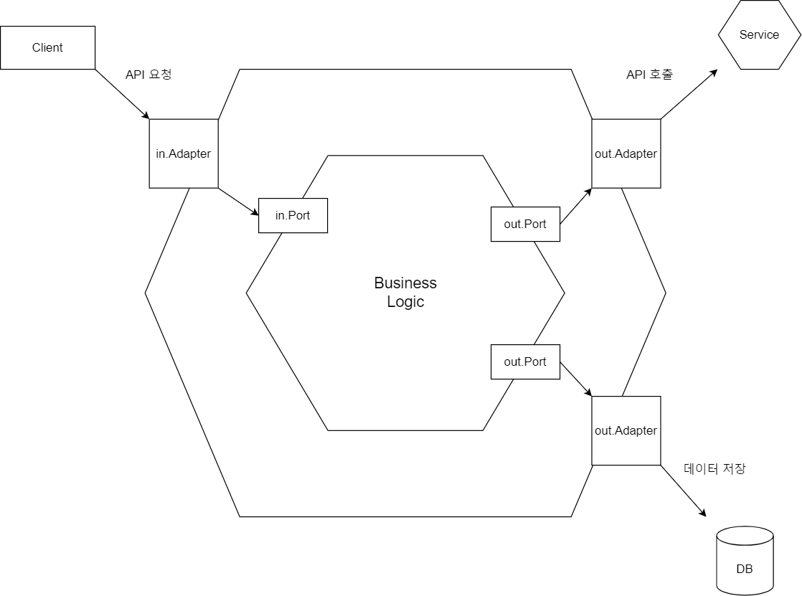

# Web SNS
### 🧐설명
* 이전 학교 팀프로젝트로 만들었던 [webSNS_SpringProject](https://github.com/lgm1007/webSNS_SpringProject) 프로젝트를 Spring Boot, JPA 등으로 포맷팅한다.
* TDD 개발 기법을 배워보기 위해 해당 프로젝트는 TDD 기법으로 개발한다.
* 헥사고날 아키텍처 구성 방식을 도입해본다.
* 프로젝트를 진행하면서 소셜 도메인에 대해 조금 이해해보도록 한다.
* 백엔드 API 기능이 얼추 개발되면 Kotlin으로 포팅해보고자 한다.

### 🔧사용 기술
* Spring Boot, Java
* Mysql
* JPA
* Thymeleaf
* Swagger (springdoc-openapi)
* OAuth2
* JUnit4

### 🗃️DB 설계
#### Member
| 컬럼 명             | 타입 |키|속성| default | 설명 |
|------------------|---|---|---|---|---|
| memberSeq        | bigint(20) |primary key|auto increment| not null |유저 sequence 값|
| memberId         | varchar(50) |unique key| | not null |유저 아이디|
| password         | varchar(255) | | | not null |유저 패스워드|
| memberName       | varchar(20) | | | not null |유저 이름|
| email            | varchar(255) | | | not null |유저 이메일|
| createdDate      | datetime | | | null |회원가입 날짜|
| lastModifiedDate | datetime | | | null |최근 수정 날짜|
| admin            | bit | | | 0 |관리자 여부|
| private          | bit | | | 0 |비공개 계정 여부|
| deleted          | bit | | | 0 |데이터 삭제 여부|

#### Board
| 컬럼 명             |타입|키|속성| default | 설명 |
|------------------|---|---|---|---|---|
| boardSeq         |bigint(20)|primary key|auto increment|not null|게시글 sequence 값|
| memberSeq        |bigint(20)|foreign key| | not null |게시글을 작성한 유저 foreign key|
| content          |text| | |null|게시글 본문 내용|
| boardImage       |text| | | not null | 게시글 업로드 이미지|
| createdDate      |datetime| | | null | 게시글 작성 날짜 |
| lastModifiedDate |datetime| | | null | 최근 수정 날짜|
| deleted          | bit | | | 0 |데이터 삭제 여부|

#### Follow
|컬럼 명|타입|키|속성| default | 설명 |
|---|---|---|---|---|---|
|followSeq|bigint(20)|primary key|auto increment|not null|팔로우 sequence 값|
|fromFollow|bigint(20)| | |not null|팔로우 하는 유저 seq 값 (팔로잉)|
|toFollow|bigint(20)| | |not null|팔로우 당하는 유저 seq 값 (팔로워)|

#### Likes
| 컬럼 명        |타입| 키           |속성| default | 설명 |
|-------------|---|-------------|---|---|---|
| memberSeq   |bigint(20)| primary key | |not null|좋아요를 한 유저 foreign key|
| boardSeq    |bigint(20)| primary key | |not null|유저가 좋아요한 게시글 foreign key|
| createdDate |datetime|             | | null |좋아요한 날짜 (최근 순 정렬 위함)|

#### Comment
| 컬럼 명        |타입|키|속성| default | 설명 |
|-------------|---|---|---|---|---|
| commentSeq  |bigint(20)|primary key|auto increment|not null|댓글 sequence 값|
| memberSeq   |bigint(20)|foreign key| |not null|댓글 작성한 유저 foreign key|
| boardSeq    |bigint(20)|foreign key| |not null|댓글 작성할 게시글 foreign key|
| content     |text| | |not null|댓글 내용|
| createdDate |datetime| | |null|댓글 작성한 날짜|

### 🔃ERD

### 헥사고날 아키텍처 구성도
* Board 도메인을 예시로 그려본 구성도

### 📝API 명세서
* Swagger 접속 링크 = http://(host):(port)/swagger-ui.html
